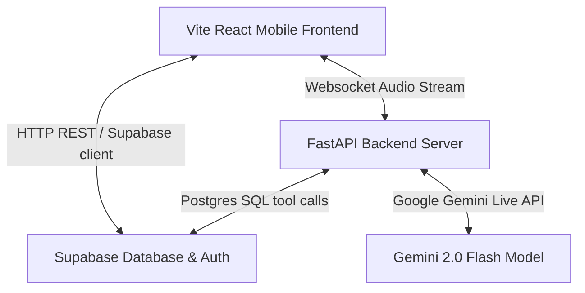

# Project Handover Document: Innaikku AI

Welcome to **Innaikku AI**! This document provides a complete guide for setting up, running, securing, and understanding the architecture of the platform.

---

## 🗺️ System Architecture Overview

Innaikku AI is a regional voice-first marketplace connecting customers and local merchants in Hosur.



- **Frontend**: Single Page Mobile React App built with Vite, vanilla CSS, and Lucide icons.
- **Backend**: FastAPI server coordinating audio streams between the frontend websocket client and the Gemini Live API.
- **Database**: Supabase PostgreSQL database handling Authentication, Shops, Products, and Wishlists.

---

## ⚙️ Prerequisites & Environment Setup

### 1. Backend Environment Variables
Create a file named `.env` in the `backend/` directory:
```env
SUPABASE_URL=your-supabase-project-url
SUPABASE_KEY=your-supabase-service-role-key-or-anon-key
GEMINI_API_KEY=your-google-gemini-api-key
```

### 2. Frontend Environment Variables
Create a file named `.env` in the `frontend/` directory (or standalone `frontend/` if running separately):
```env
VITE_SUPABASE_URL=your-supabase-project-url
VITE_SUPABASE_ANON_KEY=your-supabase-anon-public-key
```

---

## 🚀 How to Run the Project Locally

### Step 1: Run the Backend Server
1. Navigate to the `backend/` directory.
2. Install Python dependencies:
   ```bash
   pip install -r requirements.txt
   ```
3. Run the FastAPI server:
   ```bash
   python main.py
   ```
   *(Server will start at `http://localhost:8000/`)*

### Step 2: Run the Frontend App
1. Navigate to the `frontend/` directory.
2. Install npm dependencies:
   ```bash
   npm install
   ```
3. Start the Vite dev server:
   ```bash
   npm run dev
   ```
   *(Frontend dev server will start at `http://localhost:5173/`)*

---

## 🗄️ Database Setup & Security (Supabase)

### 1. Database Schema Initialization
To seed tables, custom SQL views, and triggers:
1. Open your Supabase SQL Editor.
2. Copy the contents of [`backend/supabase_schema.sql`](file:///c:/Users/Rakshana/Desktop/alliswell/backend/supabase_schema.sql) and run it. This will create:
   - Tables: `profiles`, `shops`, `items`, `offers`, `wishlists`.
   - Views: `active_offers_by_shop`, `item_wishlist_counts`.

### 2. Row-Level Security (RLS) Setup
To secure your database for production:
1. Copy the contents of [`backend/rls_policies_setup.sql`](file:///c:/Users/Rakshana/Desktop/alliswell/backend/rls_policies_setup.sql).
2. Paste it into the Supabase SQL Editor and click **Run**. This will enforce strict checks so that only approved vendors can modify catalogs, customers can only modify their own wishlists, and admins have full system override capabilities.

---

## 🧪 Demo Test Presets & Roles
To demonstrate the platform features without manually typing OTPs, click the **🔑 Quick Demo Sign-In** button on the login screen and toggle roles in the top-right header switcher:

*   **System Admin**: Phone `0000000000` (role: `admin`, bypasses approvals).
*   **Customer**: Phone `+919876543211` (role: `customer`, views catalogs & adds to wishlist).
*   **Approved Vendor**: Phone `+919999999999` (role: `vendor`, has approved shop status; can upload products and daily discount offers).
*   **Pending Vendor**: Phone `+919999999901` (role: `vendor`, shop is unapproved; metrics/catalog are locked until Admin approves them).

---

## 📁 Key File Map

- [`backend/src/agent.py`](file:///c:/Users/Rakshana/Desktop/alliswell/backend/src/agent.py): Holds the FastAPI voice agent websocket endpoint and Gemini tools mapping.
- [`backend/frontend/src/context/AuthContext.jsx`](file:///c:/Users/Rakshana/Desktop/alliswell/backend/frontend/src/context/AuthContext.jsx): Stores user state, login modes, and demo bypasses.
- [`backend/frontend/src/components/dashboard/DealsDashboard.jsx`](file:///c:/Users/Rakshana/Desktop/alliswell/backend/frontend/src/components/dashboard/DealsDashboard.jsx): Customer tab dashboard listing all products and active/expired promotions.
- [`backend/frontend/src/components/profile/VendorProfileTab.jsx`](file:///c:/Users/Rakshana/Desktop/alliswell/backend/frontend/src/components/profile/VendorProfileTab.jsx): Read-only view for vendors showing business credentials and proof document links.
- [`backend/frontend/src/components/admin/AdminDashboard.jsx`](file:///c:/Users/Rakshana/Desktop/alliswell/backend/frontend/src/components/admin/AdminDashboard.jsx): Admin view for reviewing pending approvals and viewing directories.
